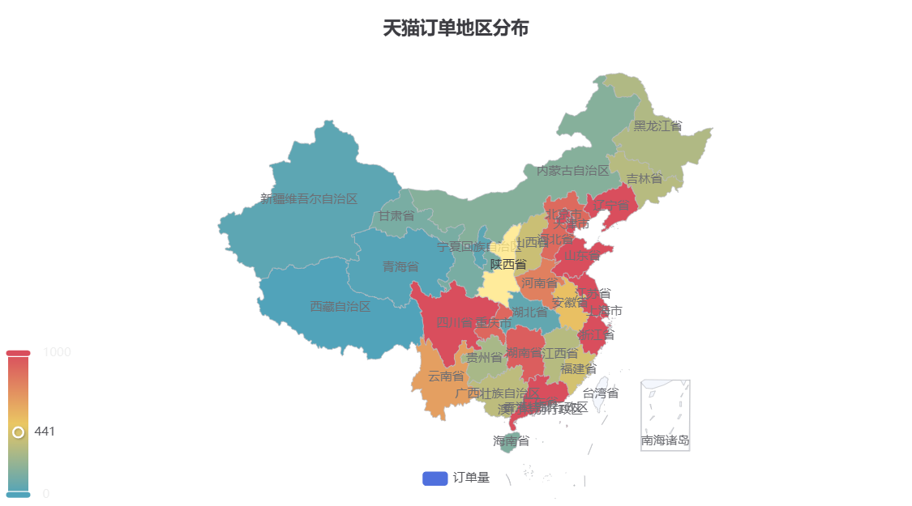
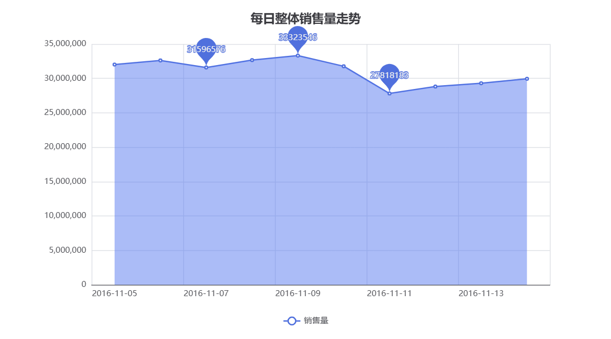

# 🛍️ 电商数据分析项目 (E-Commerce-Data-Analysis)

> 基于3份真实电商数据集的综合分析报告，涵盖天猫订单、双十一美妆、日化批发三个维度的数据挖掘与可视化分析。
>   **分析工具**：Python + Pandas + Pyecharts

## 📋 项目简介

本项目对和鲸社区的3份电商数据集进行探索性分析（EDA），主要工作包括：

- **数据清洗**：处理缺失值、重复值、异常值及格式转换
- **多维分析**：从时间、地区、商品、客户等维度挖掘业务洞察
- **可视化展示**：使用 Pyecharts 生成交互式图表
- **模型应用**：Part 3 引入 RFM 模型评估客户价值

---
## 📂 项目结构

```text
E-Commerce-Data-Analysis/
├── README.md # 项目说明文档
├── requirements.txt # Python依赖包列表
├── .gitignore # Git忽略配置
│
├── assets/ # 🖼️ 可视化图表输出（截图/PNG）
│ ├── 01_order_distribution_map.png
│ ├── 02_daily_order_trend.png
│ ├── 03_hourly_order_peak.png
│ ├── 04_double11_sales_trend.png
│ ├── 05_shop_sales_ranking_top10.png
│ ├── 06_brand_market_share.png
│ ├── 07_brand_price_ranking.png
│ ├── 08_monthly_order_volume.png
│ ├── 09_top20_cities.png
│ └── 10_province_distribution_map.png
│
├── data/ # 📊 原始数据集
│ ├── tmall_order_report.csv # Part1: 天猫订单数据
│ ├── 双十一淘宝美妆数据.csv # Part2: 美妆销售数据
│ └── 日化.xlsx # Part3: 日化批发订单（含2个sheet）
│
├── part1_tmall_analysis/ # 🔍 天猫订单数据分析
│ └── tmall_analysis.ipynb # 主分析代码（Jupyter Notebook）
│ 
│
├── part2_double11_beauty/ # 💄 双十一美妆销售分析
│ └── double11_beauty.ipynb # 主分析代码 + 时间轴动态图表
│
└── part3_daily_chemical/ # 🧴 日化批发订单分析
└── daily_chemical.ipynb # 主分析代码 + RFM客户价值模型
```
---

## 🚀 快速开始

### 环境要求
- Python 3.7+
- Jupyter Notebook

### 安装步骤

```bash
# 1. 克隆项目
git clone https://github.com/yourname/E-Commerce-Data-Analysis.git
cd E-Commerce-Data-Analysis

# 2. 安装依赖
pip install -r requirements.txt

# 3. 启动 Jupyter
jupyter notebook

# 4. 依次打开分析文件运行：
#    - part1_tmall_analysis/tmall_analysis.ipynb
#    - part2_double11_beauty/double11_beauty.ipynb
#    - part3_daily_chemical/daily_chemical.ipynb
```

---

## 📊 分析内容概览

### Part 1: 天猫订单分析
**数据集**：`tmall_order_report.csv` (28,010条订单记录)

**分析维度**：
- ✅ 整体情况：订单数、成交率、退货率、退款金额
- ✅ 地区分布：各省份订单量热力图
- ✅ 时间趋势：每日订单量走势、每小时订单高峰

**关键发现**：
- 成交率 85.99%，退货率 23.44%
- 21:00-22:00 是订单高峰期
- 东部沿海地区订单量显著高于西部

### Part 2: 双十一美妆分析
**数据集**：`双十一淘宝美妆数据.csv` (27,597条商品记录)

**分析维度**：
- ✅ 销售趋势：11.01-11.14 每日销量变化
- ✅ 品牌排行：TOP10 店铺销量/销售额对比
- ✅ 市场份额：各品牌销量占比
- ✅ 价格定位：品牌平均价格分析

**关键发现**：
- 妮维雅销量遥遥领先
- 双十一期间销量波动明显

### Part 3: 日化批发订单分析
**数据集**：`日化.xlsx` (31,445条订单，含订单表和商品表)

**分析维度**：
- ✅ 月度趋势：1-9月订购量/金额变化
- ✅ 城市分布：TOP20 热门城市
- ✅ 品类分析：商品大类/小类销量统计
- ✅ 省份分布：全国订单热力图
- ✅ 客户价值：RFM 模型打分与客户分层

**关键发现**：
- 面膜、面霜、爽肤水是销量前三的品类
- RFM 模型识别出高价值客户群体

---

## 🖼️ 可视化结果展示

### 🔹 Part 1: 天猫订单地区分布



*图1：各省份订单量分布，颜色越深表示订单量越多*

### 🔹 Part 2: 双十一销售趋势



*图2：双十一期间每日销售量变化趋势*

### 🔹 Part 3: 品牌市场份额


*图3：各美妆品牌销量占比*

> 💡 **提示**：更多高清图表请查看 `assets/` 文件夹，共 10 张可视化图表。

---

## 📦 环境依赖

安装命令：
```bash
pip install -r requirements.txt
```

---

## 📈 核心指标说明

| 指标 | 说明 |
|------|------|
| **成交率** | 已付款订单数 / 总订单数 |
| **退货率** | 退款订单数 / 已完成订单数 |
| **RFM 模型** | Recency（最近购买）、Frequency（购买频率）、Monetary（购买金额） |

---


## 📄 License

MIT License © 2024

---

<div align="center">

**如果这个项目对你有帮助，请给一个 ⭐ Star！**

</div>

---
